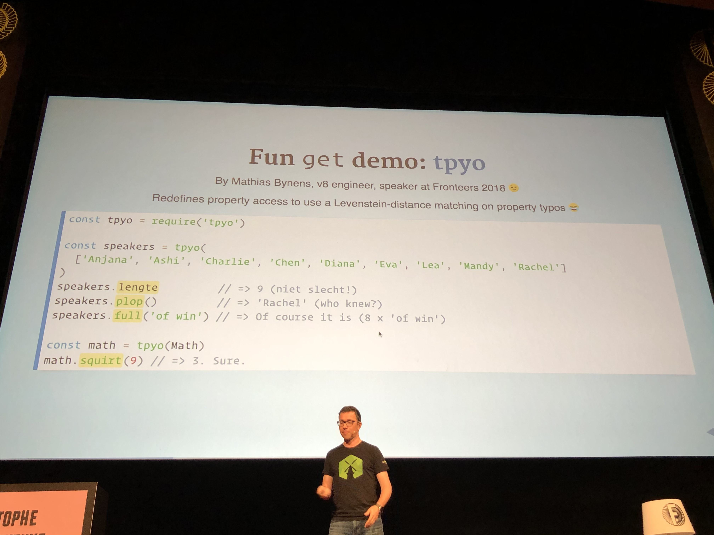
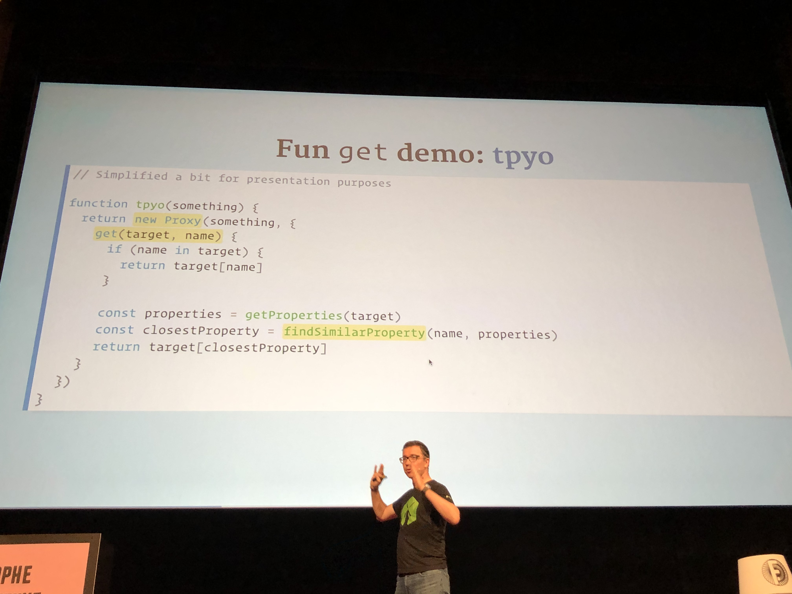
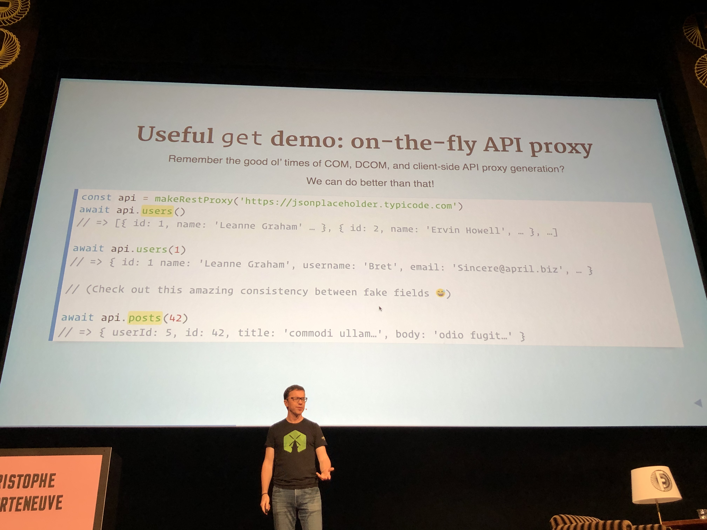
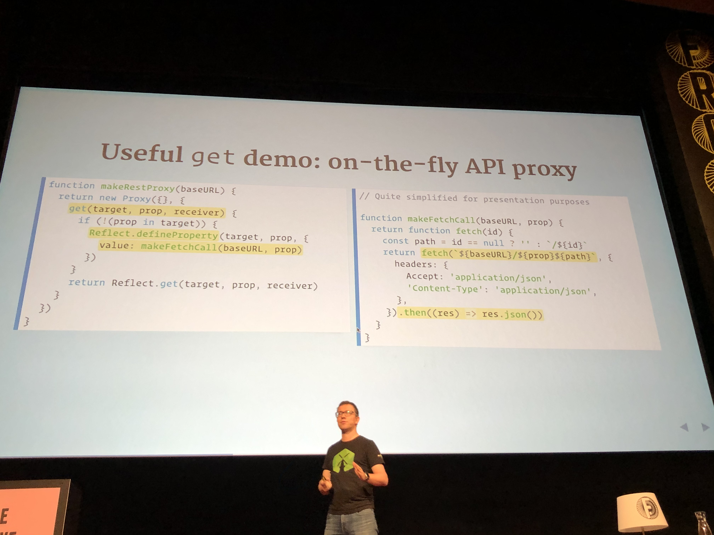
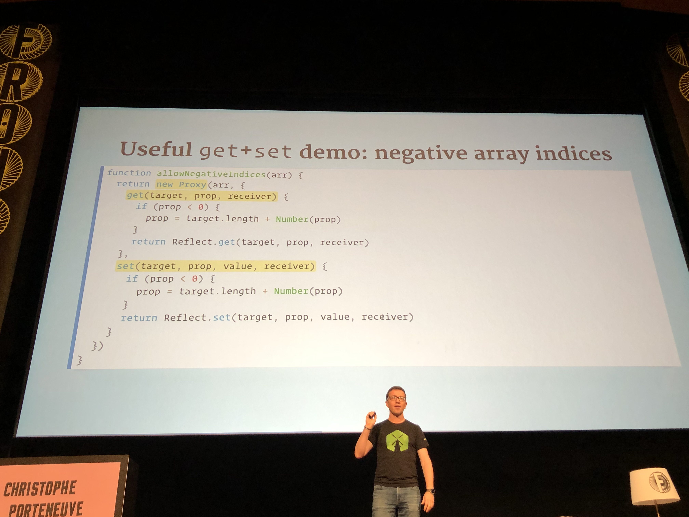
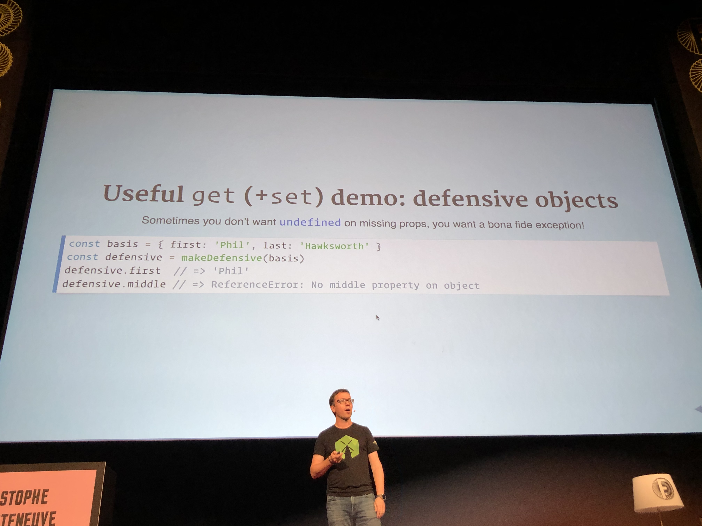
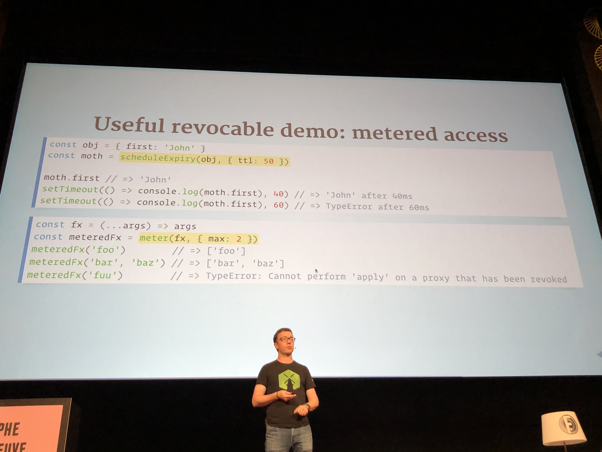
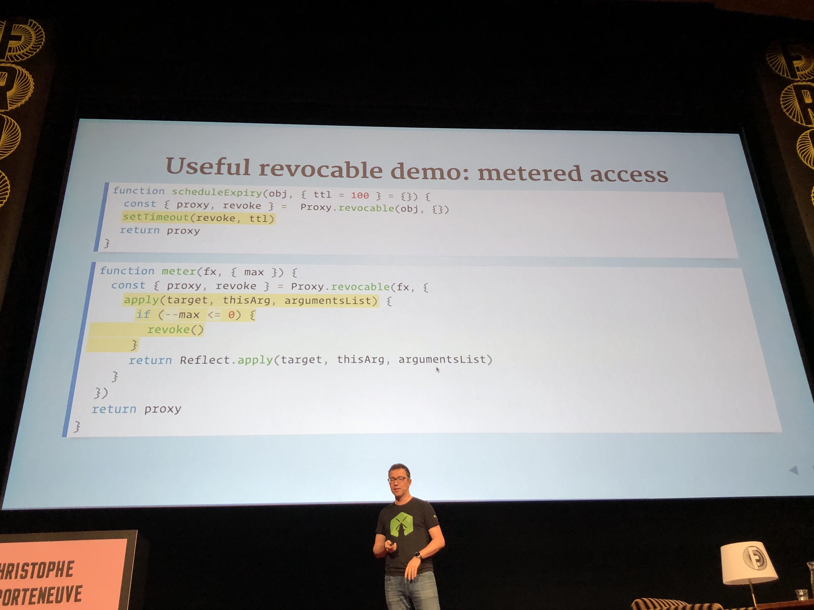
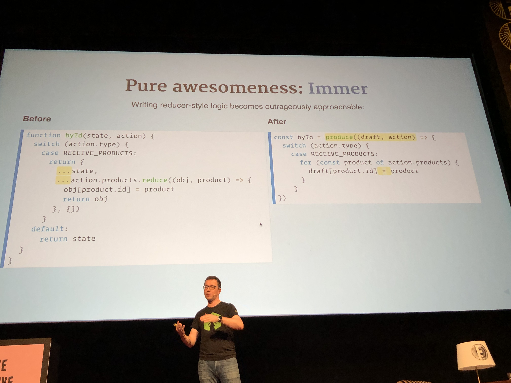

# Chen Hui Jing - A deep dive into images on the web
Pixel: the smallest unit of an image which can be displayed on a digital display device. We have raster and vector images. Raster is also known as bitmap, and is comprised of pixels in a grid.

JPEG Optimisation tips:
1. Use HQ source material
2. Alignment on the 8x8 pixel grid
3. Reduce contrast and saturation
4. Use sepia images, and color them with CSS
5. Slight blurring

Pick two: speed, quality, size.

Optimising PNG files
1. Reduce number of colours
2. Choose the right pixel format
3. Use indexed images, if possible
4. Optimise fully transparent pixels

## Slides:
[A deep dive into images on the web](https://www.chenhuijing.com/slides/71-fronteers-2019/#/)

## Resources:
[Una Kravets: CSS Blend Modes, Because … - JSConf.Asia 2018 - YouTube](https://www.youtube.com/watch?v=XZmvHVVj0Ns)
[Quantum Up Close: What is a browser engine? - Mozilla Hacks - the Web developer blog](https://hacks.mozilla.org/2017/05/quantum-up-close-what-is-a-browser-engine/)

# Christophe Porteneuve - Fun & Games with ES Proxies
ES Proxies let us redefine the semantics of some core language features. This is a meta programming feature. Other features like that are Object.* methods and iterators. They let you alter default language functions. Proxies doe not alter the original object, it wraps them.
`const proxy = new Proxy(originalObject, handler)`
Use cases: reactivity, data binding, monitoring, delegation.

**Trap**: function with a pre-defined name that intercepts a language interaction to replace or customise it. It can delegate to the original behaviour by using the `Reflect` API.

A **handler** is an object that bundles a series of traps. It is usually single-topic and implements just enough traps for its feature.

## Available traps:
- get (reading a property)
- set (writing a property)
- has (the `in` operator)
- ownKeys
- getOwnPropertyDescriptor
- deleteProperty
- apply (calling a function)
- construct 
- ..many more

The Reflect namespace has methods for every trap, with matching signatures. Sometimes it feels like a duplicate of Object methods , but there could be subtle differences: no casting, returning bools instead of throwing. In general, they’re lighter than matching Object methods. Sort of corresponds to what the ES spec calls “internal slots”,  such as `[[Call]]`

The two most useful traps are `get` and `set`:
`get(target, property, receiver)` :  intercepts property reads. Default behaviour leverages the reader accessor if any, and defaults to undefined for missing properties.

`set(target, property, value, receiver)`: intercepts property writes.

## tpyo demo:

## Core code tpyo (simplified):

## API fetching

## Negative array indices:

## Defensive objects:
Sometimes you don’t want undefined on missing props, you want a bonafide exception.

`Apply` and `construct` are traps designed for functions. `Apply` intercepts the fall to a function. Useful for copy-on-write implementations that need to automatically wrap method return values in proxies.
Construct is the same thing for `new`,  so it intercepts using the `new` operator on the function. The result must be an object. 

Proxies can be revocable. It’s an alternate construction method that lets us revoke access to the underlying object (through the proxy, that is) at any time for any reason. Makes for “perishable” references.
`const { proxy, revoke } = Proxy.revocable(target, handler)`.
This has use cases in security-related scenarios, metered access.

## Example revocability:

 
## Resources:
[GitHub - mathiasbynens/tpyo: A small script that enables you to make typos in JavaScript property names. Powered by ES2015 proxies + Levenshtein string distance.](https://github.com/mathiasbynens/tpyo)
[GitHub - immerjs/immer: Create the next immutable state by mutating the current one](https://github.com/immerjs/immer): immutability helper, lets us write mutative code. Copy-on-write for nested structures using recursive revocable proxying with almost every trap. 
Writing reducer-style logic becomes very approachable:

[Copy-on-write - Wikipedia](https://en.wikipedia.org/wiki/Copy-on-write)

# Jad Joubran - Secrets of native-like PWAs
…

# Paul Lewis - Custom Web Shadow Elements, or whatever…
..