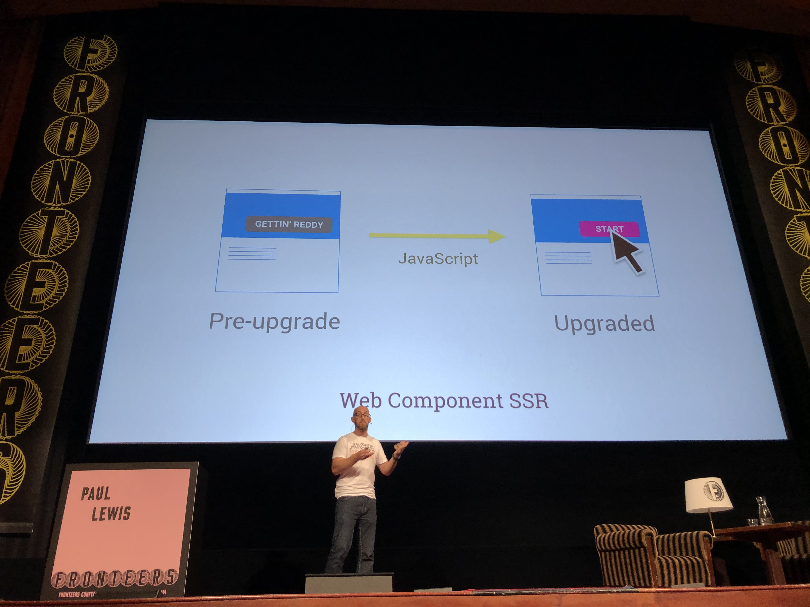

# Chen Hui Jing - A deep dive into images on the web
Pixel: the smallest unit of an image which can be displayed on a digital display device. We have raster and vector images. Raster is also known as bitmap, and is comprised of pixels in a grid.

JPEG Optimisation tips:
1. Use HQ source material
2. Alignment on the 8x8 pixel grid
3. Reduce contrast and saturation
4. Use sepia images, and color them with CSS
5. Slight blurring

Pick two: speed, quality, size.

Optimising PNG files
1. Reduce number of colours
2. Choose the right pixel format
3. Use indexed images, if possible
4. Optimise fully transparent pixels

## Slides:
* [A deep dive into images on the web](https://www.chenhuijing.com/slides/71-fronteers-2019/#/)

## Resources:
* [Una Kravets: CSS Blend Modes, Because …
JSConf.Asia 2018 - YouTube](https://www.youtube.com/watch?v=XZmvHVVj0Ns)

* [Quantum Up Close: What is a browser engine?
Mozilla Hacks - the Web developer blog](https://hacks.mozilla.org/2017/05/quantum-up-close-what-is-a-browser-engine/)

# Christophe Porteneuve - Fun & Games with ES Proxies
ES Proxies let us redefine the semantics of some core language features. This is a meta programming feature. Other features like that are Object.* methods and iterators. They let you alter default language functions. Proxies doe not alter the original object, it wraps them.
`const proxy = new Proxy(originalObject, handler)`
Use cases: reactivity, data binding, monitoring, delegation.

**Trap**: function with a pre-defined name that intercepts a language interaction to replace or customise it. It can delegate to the original behaviour by using the `Reflect` API.

A **handler** is an object that bundles a series of traps. It is usually single-topic and implements just enough traps for its feature.

## Available traps:
* get (reading a property)
* set (writing a property)
* has (the `in` operator)
* ownKeys
* getOwnPropertyDescriptor
* deleteProperty
* apply (calling a function)
* construct
* ..many more

The Reflect namespace has methods for every trap, with matching signatures. Sometimes it feels like a duplicate of Object methods , but there could be subtle differences: no casting, returning bools instead of throwing. In general, they’re lighter than matching Object methods. Sort of corresponds to what the ES spec calls “internal slots”,  such as `[[Call]]`

The two most useful traps are `get` and `set`:
`get(target, property, receiver)` :  intercepts property reads. Default behaviour leverages the reader accessor if any, and defaults to undefined for missing properties.

`set(target, property, value, receiver)`: intercepts property writes.

## tpyo demo:

## Core code tpyo (simplified):

## API fetching

## Negative array indices:

## Defensive objects:
Sometimes you don’t want undefined on missing props, you want a bonafide exception.

`Apply` and `construct` are traps designed for functions. `Apply` intercepts the fall to a function. Useful for copy-on-write implementations that need to automatically wrap method return values in proxies.
Construct is the same thing for `new`,  so it intercepts using the `new` operator on the function. The result must be an object.

Proxies can be revocable. It’s an alternate construction method that lets us revoke access to the underlying object (through the proxy, that is) at any time for any reason. Makes for “perishable” references.
`const { proxy, revoke } = Proxy.revocable(target, handler)`.
This has use cases in security-related scenarios, metered access.

## Example revocability:

## Resources:
* [GitHub - mathiasbynens/tpyo: A small script that enables you to make typos in JavaScript property names. Powered by ES2015 proxies + Levenshtein string distance.](https://github.com/mathiasbynens/tpyo)

* [GitHub - immerjs/immer: Create the next immutable state by mutating the current one](https://github.com/immerjs/immer): immutability helper, lets us write mutative code. Copy-on-write for nested structures using recursive revocable proxying with almost every trap. Writing reducer-style logic becomes very approachable:

* [Copy-on-write - Wikipedia](https://en.wikipedia.org/wiki/Copy-on-write)

# Jad Joubran - Secrets of native-like PWAs
There are three main pillars that make a successful PWA: UI, UX and reliability. For UI, check out the Ionic framework. An `App shell` is the first step to getting your app work offline:

> “An *application shell* (or app shell) architecture is one way to build a Progressive Web App that reliably and instantly loads on your users’ screens, similar to what you see in native applications.”  

Advanced app shells are possible on the web today. It’s not easy though.

Resources:
- [Open Source Framework for Building Amazing Mobile Apps](https://ionicframework.com/framework)
- [The App Shell Model  |  Web Fundamentals  |  Google Developers](https://developers.google.com/web/fundamentals/architecture/app-shell)
- [Service Workers: an Introduction  |  Web Fundamentals](https://developers.google.com/web/fundamentals/primers/service-workers)
- [ES6 Modules in Depth](https://ponyfoo.com/articles/es6-modules-in-depth)

# Paul Lewis - Custom Web Shadow Elements, or whatever…
Standards versus proprietary. Proprietary software is moving faster because it is not beholden to everything. The platform doesn’t always offer all the features we need, so we write them ourselves. Typically, the proprietary ships more code than the browser binaries that already contain the features. Another thing about proprietary is lock-in. Once you’ve written all your code in $frameWork and something changes, your code is no longer relevant. And rewriting can be very expensive. Breaking changes are also costly. Proprietary software can also be abandoned.

Standards take a long time. CSS Grid took years to be implemented in browsers. The upside is that they rarely change once they ship. Once they’re in browsers, they can’t be removed. Websites we had 20 years ago still work today. This brings portability with it: write it in one browser, and it’ll work in another — mostly.

Standards - proprietary is a continuum.  We get to move along this continuum. Once things work well, we can pass things down from the proprietary to the standards bodies. Example: `querySelector(All)`. This came from jQuery, which is obviously proprietary.

There is dysfunction in the standards world: “I won’t use anything unless it’s been standardised first” — you’ll see this on Twitter. On the other hand, proprietary has its issues: “I do what I want whenever I want how I want, I’m not answerable to anyone”.

Do we need features? -> proprietary

Do we need portability? -> standards

Do we need performance? -> standards (less bytes over the wire, the better). 

Pick *two* of these. We’re always making a trade-off.

**Claim**: Web Components don’t work without JavaScript. This is strange, because what are you comparing it to? Frameworks need JS as well. If you compare it against an HTML element, then yes. But what is the actual problem?

**Claim**: shadow DOM makes SSR impossible. But a standard SSR solution also needs hydration. Web component SSR can be seen more as “pre-upgrade” and “upgraded”:

**Claim**: web components are verbose. This is true, but there’s no magic to it either. Another trade-off.

**Claim**: web components don’t work with frameworks. This is just not true, you can mix them. The exception is React. Is React maybe preventing the use of Custom Elements? React passes all data to Custom Elements in the form of HTML attributes. For primitive data this is fine, but the system breaks down when passing rich data, like objects or arrays. In these instances you end up with stringified values like `some-attr=“[object Object]”` which can’t actually be used. Because React implements its own synthetic event system, it cannot listen for DOM events coming from Custom Elements without the use of a workaround. Developers will need to reference their Custom Elements using a ref and manually attach event listeners with addEventListener. This makes working with Custom Elements cumbersome.

So who’s right? The real conflict is who gets to define the component model. For the longest time, the proprietary world did this. There were no Web Components, so the people behind frameworks got to do this. And now the standards world is coming in with its own opinions. 

Standards are good, and it’s easy to take that for granted. Compared to 10 years ago, interoperability is pretty great. However, proprietary is also good - it represents our ability to explore. It’s easier to come back from proprietary decisions. You can’t turn back standards once they’re implemented.

Standards are the _known_, proprietary	is the _unknown_. If you don’t move, you stagnate. But if you move too much, you get risk. So, who’s right? When one blocks the other it’s a bug. Example: styling a `select`. It’s horrible, and can be regarded as a bug because the standard is blocking the proprietary.  

*The standard did not block the proprietary, but the proprietary is blocking the standard, and that’s a bug in React.*

> In case of conflict, consider users over authors over implementers over specifiers over theoretical purity.  
> Developer > Vendor  
> User > Developer  

# Resources
[Custom Elements Everywhere](https://custom-elements-everywhere.com/)